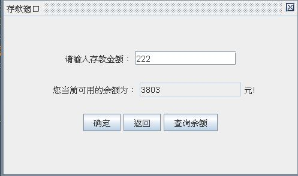

 ## ATM
模拟现实ATM功能，实现存、取款、修改密码、转账等基本功能  JAVA GUI Application
 
Simulate real-world ATM functions, implement basic functions such as deposit, withdrawal, password change, and transfer
 
**初始开户 需用管理员登录 帐号密码均为：admin  
管理员可开户、销户、查询账户信息**
 
## 登录窗口界面
 

 
## 主操作窗口
 

 
## 存款窗口
 

 
## 取款窗口
 

 
## 修改密码窗口
 

 
## 转账窗口
 

